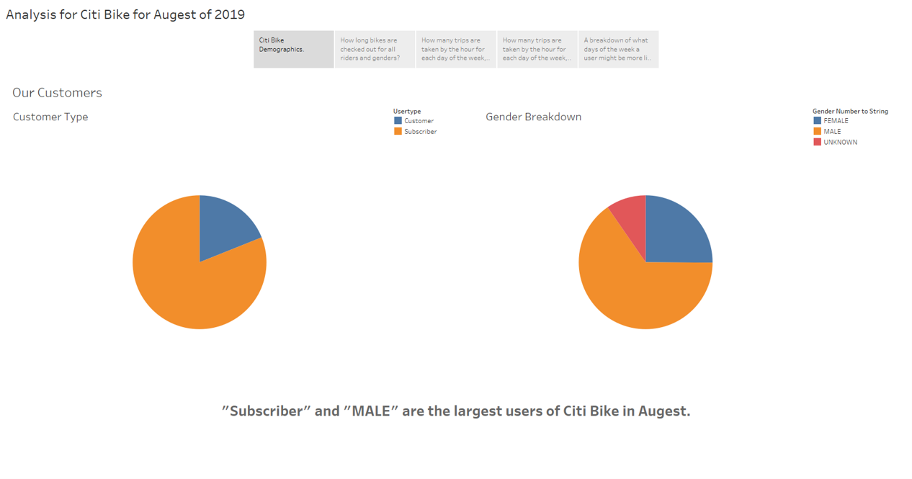
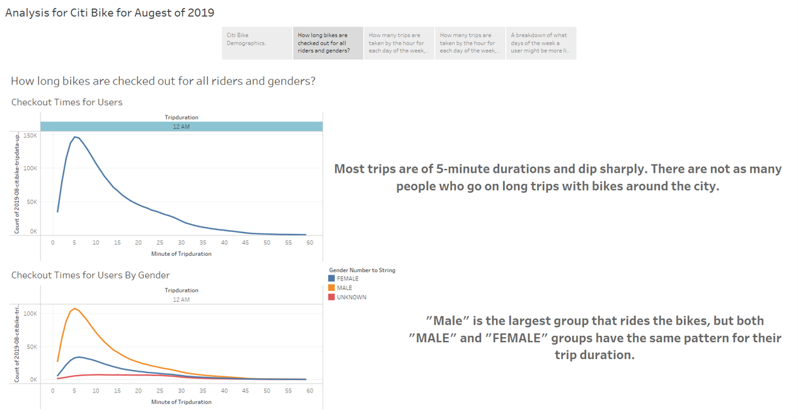
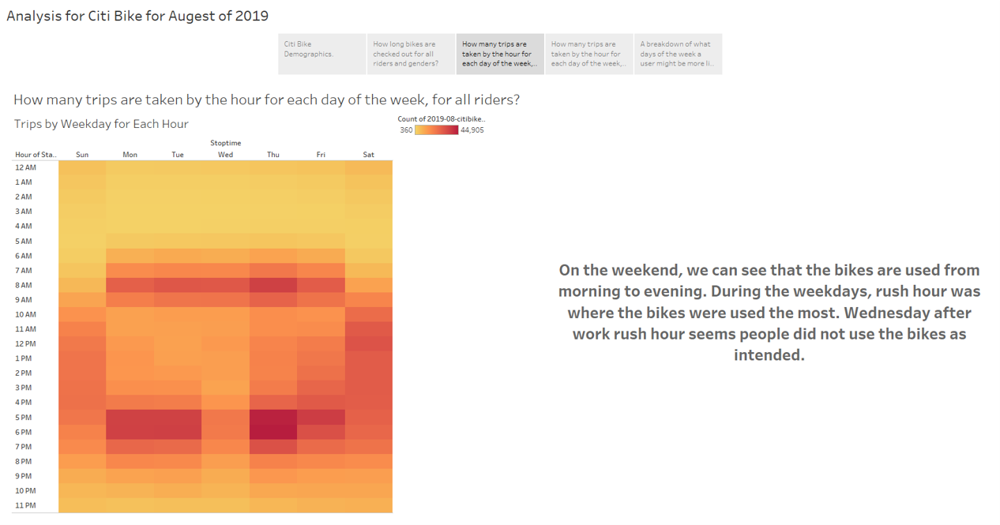
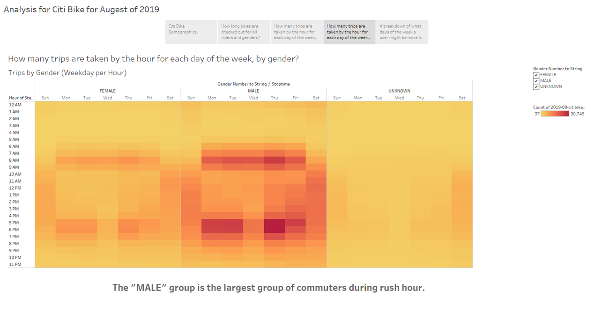
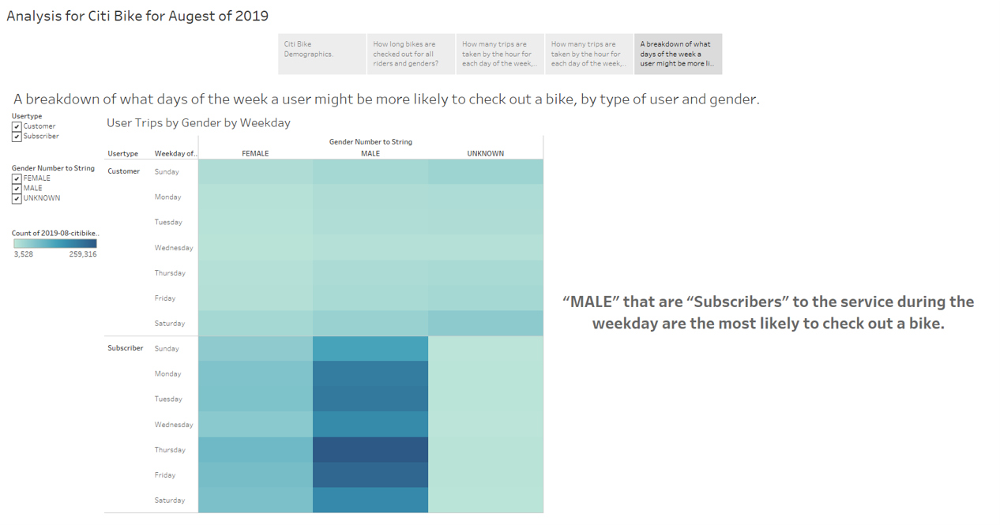

# Bike Sharing

## Overview
The exercise was to get a basic understanding of Tableau. We used data from the Citi Bike data source and analyze ddata from Augest of 2019.

Website to the Story: https://public.tableau.com/profile/matthew.harmon1936#!/vizhome/CitiBikeTripDatafromAugestof2019/AnalysisforCitiBikeforAugustof2019

## Results

## Summary

Male subscribers to the service are the largest demographic that use the Citi Bike service during rush hour times. During Wednesday, after-work rush hour seems to drop off in terms of use of the service.

I would have loved to add a visualization of starting location and end locations being on the same map with a time selector of start time to see where people are commuting to and from.

Another visualization to visualize is which bikes get used the most.
